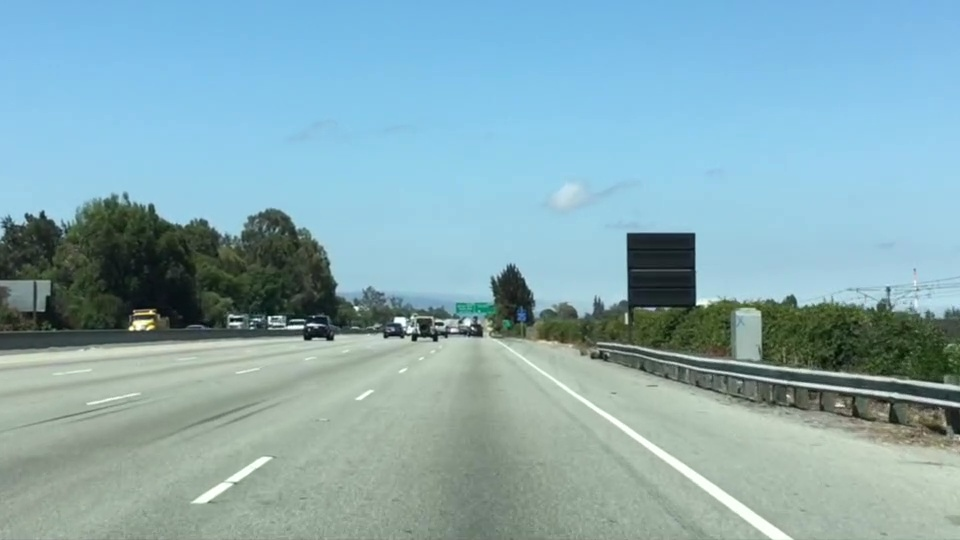

# Computer Vision Fundamentals

## [Color Selection](01_color_selection.py)

### Objective

The objective of this script is to detect white lines in an image.

### Steps

1. Read the image.
2. Copy the image to avoid modifying the original.
3. Define the color selection criteria.
4. Create a mask that highlights the pixels that meet the criteria.
5. Display the mask.
6. Save the mask.

### Usage

```bash
python 01_color_selection.py
```

### Output

The output is a mask that highlights white pixels in the image.

### Example

|      Original Image       |                    Mask                    |
| :-----------------------: | :----------------------------------------: |
|  |  |

## [Regin Masking](02_region_masking.py)

### Objective

The objective of this script is to place a red mask in the region of interest in an image.

### Steps

1. Read the image.
2. Copy the image to avoid modifying the original.
3. Define the triangular region of interest.
4. Fit lines to identify the  3 sided region of interest.
5. Find the region inside the lines.
6. Color pixels red which are inside the region of interest.
7. Display the mask.
8. Save the mask.

### Usage

```bash
python 02_region_masking.py
```

### Output

The output is a mask that highlights white pixels in the region of interest.

### Example

|      Original Image       |                   Mask                    |
| :-----------------------: | :---------------------------------------: |
|  |  |
